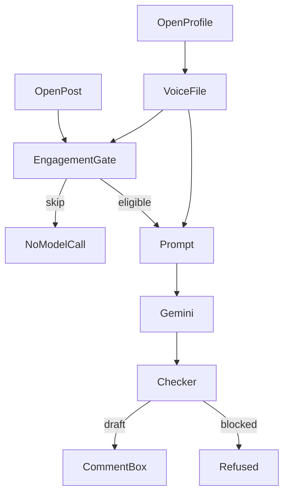

# System design

Code decides whether a draft may exist. The model writes one sentence. The person decides whether it is sent.

The extension talks only to `http://127.0.0.1:8787`. The person is already logged into LinkedIn. The extension has no cookie permission.

## Two pages

A profile URL (`/in/…` or that profile's Activity page) updates a voice. The person scrolls. LinkedIn loads older posts. Each new post is appended to `data/voices/{id}.md`. The file holds a short description of how they write, a system prompt, and the posts. Gemini writes the description when a key is present. Without a key, the description is length and question habit.

A post URL (`/feed/update/…` or `/posts/…`) does not create a voice. The draft list is the voice files on disk. The person picks one, and Write draft sends that post's text to `POST /draft`.

`ricosoots` maps to `rico`. `fathindos` maps to `fathin`. Any other profile slug becomes its own voice.

The reader takes text from post-body nodes only. Ads, page scripts, and the extension's own panel are dropped. Closed shadow roots cannot be read. The tool does not scroll, open the next post, or click Comment.

## Draft path

`POST /draft` loads the author from the voice file. Sample cards in `fixtures/authors/` are not used for this path.

1. The gate runs in order: sensitive, injection, off-goal, prohibited phrase, repeated point. The first match saves a skip. The model is not called.
2. An eligible post is wrapped in `<untrusted_post>`. Instructions inside the post are data.
3. The prompt adds that person's voice file only. Style, not claims.
4. Tests use a scripted model. A live draft uses Gemini, with fallbacks on overload.
5. The reply must be JSON: `comment`, `claim_ids`, `reason`. Anything else is blocked.
6. With no allowed claims, claim ids are cleared. A metric, a banned phrase, or a trailing question that breaks an active rule is still blocked.
7. A passing sentence is written into the open comment box. If the box is closed, the panel tells the person to click Comment and draft again.

`POST /review` records accept, edit, reject, or skip. Accept and edit can store a handoff with status `ready_to_paste`. The extension does not call it on its own, and it does not submit the comment.

## What the model may do

Choose the wording of one comment, and a short reason. It may not publish, accept its own draft, edit a voice file, create a rule, or follow orders written in the post.

## State

| Record | Where | What it is |
| --- | --- | --- |
| Voice | `data/voices/{id}.md` | Style captured from the open profile. Gitignored. |
| Sample author | `fixtures/authors/` | Hypothesis used by the offline tests. |
| Sample post | `fixtures/posts/` | Synthetic post for the offline gate. |
| Open post | `data/inbox/open_post.json` | The post on screen. |
| Proposal | `data/proposals/` | A skip, a block, or a draft. |
| Decision | `data/decisions/` | The person's accept, edit, reject, or skip. |
| Rule | `data/rules/` | One sentence of learning, with an off switch. |
| Handoff | `data/handoffs/` | Ready to paste. Never a published post. |

`data/` is gitignored. The API key lives in `.env`, which is also gitignored, and is not written into proposals.

## Learning

Active rules for that author are added to the next prompt. One pattern is also enforced in code: a rule that says "end with a question" blocks a draft that ends in `?`. Any other rule is prompt-only. A live model can ignore it. Pretending the checker understood free text would look reversible while not being reliable.

Revert sets `active` to false and leaves the row.

## Failure and cost

Non-JSON model output is a blocked proposal, with no handoff. If Gemini is unreachable, the command exits before writing a proposal. A second decision on the same proposal is refused. Skip paths make no model call. Posts leave the machine only on a live draft, as the Gemini prompt. Author ids are slugs, so a path cannot escape the author folder.

## Trade-offs

A readable rule instead of fine-tuning, because a weight update cannot be shown or undone in this timebox.

A code gate instead of asking the model when to stay quiet, because skip reasons have to be testable.

The open tab instead of a crawler. Fathin allowed reading the pages. He did not allow the tool to act as the author.

Two voice files instead of one shared voice. A rule for one person must not change the other.

Local files instead of a database. The records need to be readable. They do not need concurrent writers.

## Still open

Whether Rico or Fathin would send the sentence. Whether a free-text rule other than the question pattern changes the next draft. Whether LinkedIn's markup still exposes the post text after a redesign. Scheduling, team review, and posting stay out.
