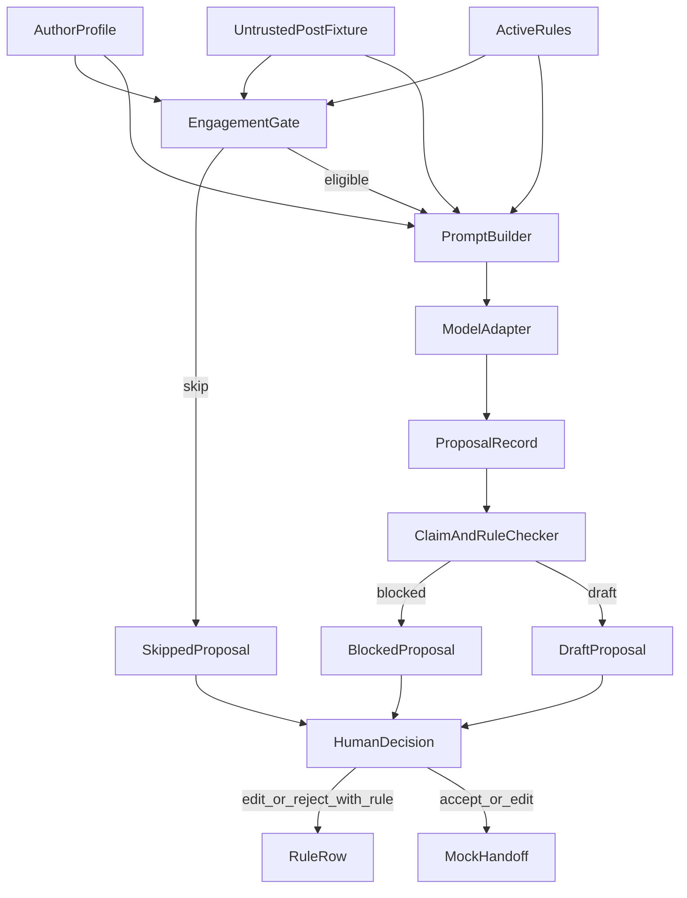

# System design

The model drafts. Deterministic code decides whether a draft is allowed to exist. The named person decides whether a sentence is ready to paste. Learning is a rule row that can be read and turned off.

## Capture

`engage serve` listens on `127.0.0.1:8787`. The unpacked extension in `extension/` talks only to that address.

1. The person opens a LinkedIn profile or post in their own browser, already logged in. The extension has no cookie permission and no login step.
2. Read visible posts runs `readLinkedInPage` in that tab. It returns text already on screen. It does not scroll, page through activity, or open other profiles.
3. `POST /capture` summarizes length, question rate, and up to three short samples. Known profile slugs map to the existing ids: `ricosoots` to `rico`, `fathindos` to `fathin`. The response is not written to disk.
4. Save this voice writes the confirmed card. Existing allowed claims, prohibited phrases, topics, and goal stay. New samples are added as voice examples. A new person starts with no allowed claims, so a model draft is refused until a claim is added by hand.
5. Draft from the longest post on screen writes `data/inbox/open_post.json` and runs the same gate, prompt, and checker as a fixture. The topic is that author's first topic, because the person chose the post. Sensitivity, injection, prohibited phrases, and repeated points still skip with no model call.
6. Keep, change, and drop call `POST /review`, which is the same decision record as the CLI. Accept and edit can produce `ready_to_paste`. The extension does not submit the comment to LinkedIn.

## Voice memory

Opening a profile (`/in/…` or that profile's recent activity) reads the posts already on screen and writes `data/voices/{id}.md`. The file has how they talk, a system prompt, and the posts. A later visit appends posts that were not there. Gemini writes the tone when a key is present. Without a key, the tone is the measured length and question habit. That text is style. It is added to the next draft prompt for that author only.

A single post URL is not a profile. It does not create a voice. Draft fills the open comment box and does not press Enter or the Post button.

## Primary flow

`engage propose --author rico --post fixtures/posts/01-on-goal.json`

1. Load the author profile and the post file. Load active rules for that author from the local store.
2. Run the gate in this order: sensitive, injection, off-goal, prohibited phrase in the post, repeated point. The first match returns a skipped proposal. The model is not called. Prompt and model output stay empty.
3. If the post is eligible, build a prompt. The post sits inside `<untrusted_post>` tags. The instruction above those tags says the post is data.
4. The model adapter returns text. Tests pass a scripted adapter. `propose --live` uses Gemini.
5. Parse the text as JSON: `comment`, `claim_ids`, `reason`. Unparseable output becomes a blocked proposal.
6. The checker blocks a draft that has no allowed claim id, cites an unknown id, contains a prohibited phrase, contains a metric that is not in the cited claim, or breaks a recognized active rule.
7. A passing result is stored as a draft. Nothing is written to the decision or handoff stores.

`engage decide --proposal ID --action edit --text "..." --rule "do not end with a question"`

8. Accept is valid only for a draft that already passed the checker. The handoff text is the proposal comment, unchanged.
9. Edit stores the person's sentence and a handoff. The model comment remains on the proposal.
10. Reject and skip store a decision and no handoff.
11. A rule is saved only on edit or reject, and only when `--rule` is present. It is tied to that decision and that author.
12. `engage revert-rule --id RULE` sets `active` to false. The row stays. The next prompt omits it.

`engage show --author rico` prints the goal, voice examples, claims, and every rule, including inactive ones.

## What AI may decide

AI may choose wording for one comment and a short reason that the post fits the goal. It may return no claim ids when it cannot ground a sentence. The checker then blocks the draft.

## What AI may not decide

AI may not publish, mark a handoff, accept its own draft, change a voice card, create or delete a rule, or treat instructions inside the post as orders. Skip reasons come from the gate, not from the model.

## State and data boundaries

| Record | Where | Who writes it | What it is |
| --- | --- | --- | --- |
| Author profile | `fixtures/authors/` | Supplied with the proof, replaced only when the person clicks Save | Goal, voice examples, allowed claims, prohibited phrases, recent points |
| Post | `fixtures/posts/` or `data/inbox/open_post.json` | Fixture, or one visible post the person chose | Untrusted text plus topic and sensitivity |
| Proposal | `data/proposals/` | `propose` | Model output, or a skip with no model output |
| Decision | `data/decisions/` | `decide` | The person's action and final sentence |
| Rule | `data/rules/` | `decide`, flipped by `revert-rule` | Learning. `{author_id, source_decision_id, text, active}` |
| Handoff | `data/handoffs/` | `decide` on accept or edit | Mock external action. Status is only `ready_to_paste` |

`data/` is runtime state and is gitignored. Fixtures are the supplied content. Generated proposals are not mixed into author files.

Topic and sensitivity are fields on the fixture. This proof does not ask a model to invent them. Injection markers and prohibited phrases are read from the post text.

## Learning

A rule is plain text the person can read. The prompt builder adds active rules for that author only.

One pattern is also enforced in code: if the rule text contains "end with a question", a draft that ends in `?` is blocked. Any other rule is prompt-only. A live model can ignore it, and the checker will not catch that. That limit is intentional. A free-text rule the checker pretends to understand would look reversible while not being reliable.

Revert keeps the row and clears `active`. The next prompt and the checker both ignore it.

## Failure, recovery, privacy, cost

- Model returns non-JSON: blocked proposal, no handoff. Run `propose` again.
- Model is unreachable on `--live`: the command exits before writing a proposal. No partial handoff.
- A bad rule: `show` lists it, `revert-rule` turns it off.
- A second decision on the same proposal is refused, so the audit does not fork.
- Posts and voice cards leave the machine only on `--live`, as the Gemini prompt. The default tests make no network call.
- Skip and blocked paths make no handoff. Eligible skips make no model call, so they cost nothing.
- The API key is read from `GEMINI_API_KEY` or `.env`. `.env` is gitignored. The key is not written into proposals.
- Author ids are limited to a slug so a fixture path cannot escape `fixtures/authors/`.

## Trade-offs

Explicit rules instead of fine-tuning. A weight update would not show what changed or how to undo it, and this timebox cannot validate one.

A deterministic checker instead of asking the model to abstain. The model is the component most likely to invent a metric. The veto has to run in code that the tests execute.

Supplied topic and sensitivity instead of a classifier. It keeps the proof honest about what was tested. It also means the gate is only as good as the fixture metadata. The next experiment is whether Rico agrees with those skip calls.

Human edit can override a skip. The gate recommends silence. The named person can still write a comment. Accept cannot launder a blocked model sentence through that override.

Two profiles instead of one voice. Fathin and Rico were both named. Merging them would make "in my voice" untestable.

Local JSON instead of a database. The records need to be readable in a file. They do not need concurrent writers.

## Deferred

Scheduling, team review, accounts, and any structural rule other than a trailing question. Background crawling and posting stay out. Voice match waits on a confirmed capture from the page the person opened, plus their review of the next draft.
